# 🛡️ Awesome Security Awareness Training & Phishing Simulation



<div align="center">

<a href="https://github.com/ishandutta2007/Awesome-Awesome-Awesome"></a><a href="https://discord.gg/jc4xtF58Ve"></a> <a href="https://github.com/ishandutta2007/Awesome-Security-Awareness-Training/stargazers"></a> <a href="https://github.com/ishandutta2007/Awesome-Security-Awareness-Training/network/members"></a> <a href="https://github.com/ishandutta2007/Awesome-Security-Awareness-Training/blob/main/LICENSE"></a> <a href="https://github.com/ishandutta2007/Awesome-Security-Awareness-Training/pulls"></a><a href="https://github.com/ishandutta2007"></a>

**A curated index of top Security Awareness Training (SAT) platforms, Human Risk Management (HRM) suites, simulated phishing tools, microlearning modules, and open-source campaign frameworks.**

*Empowering CISOs, security engineers, and awareness leads to benchmark commercial solutions and open-source tooling for workforce cyber defense.*

</div>

---

## 🧭 Table of Contents

- [🏢 SaaS & Commercial Platforms](#-saas--commercial-platforms)
- [💻 Open-Source GitHub Projects](#-open-source-github-projects)
- [🧩 Architecture & Implementation Blueprint](#-architecture--implementation-blueprint)
- [🤝 How to Contribute](#-how-to-contribute)
- [📈 Star History](#-star-history)
- [⚖️ Disclaimer & Ethical Use](#️-disclaimer--ethical-use)

---

## 🏢 SaaS & Commercial Platforms

> 📊 **Market Size & Sector Dynamics:** The global Security Awareness Training (SAT) and Human Risk Management (HRM) market is currently valued at approximately **$2.5 Billion** and is projected to reach **$5.2+ Billion by 2028 (~16.5% CAGR)**. The sector is **moderately fragmented**—evolving from legacy, check-the-box compliance training dominated by a few enterprise cybersecurity giants towards specialized, AI-driven behavioral telemetry and adaptive microlearning ecosystems.

*Sorted descending by company size (Valuation / Acquisition / Annual Revenue).*

| Platform / Product | Description | Company Size / Valuation | Pricing (Starting Tier) | Free Tier / Trial Limits |
| :--- | :--- | :--- | :--- | :--- |
| **[Proofpoint Security Awareness](https://www.proofpoint.com/)** | 🛡️ Enterprise security awareness training and phishing simulation integrated with Proofpoint email threat intelligence and Targeted Attack Protection (TAP). | **$12.3B Valuation** (Acquired by Thoma Bravo) • ~$1.4B+ Annual Revenue | **~$1.50 / user / month** (~$18.00/user/yr billed annually for entry tier; volume-tiered) | **30-day proof-of-concept evaluation** via sales consultation + free one-time **People Risk Assessment** diagnostic. |
| **[KnowBe4](https://www.knowbe4.com/)** | 🏆 World's largest security awareness platform featuring simulated phishing, human risk management (HRM), compliance training, and extensive interactive modules. | **$4.6B Valuation** (Acquired by Vista Equity Partners) • ~$400M+ ARR | **$1.80 / user / month** ($21.60/user/yr billed annually for Silver tier, 25–50 seats; min. 25 users) | **Free Phishing Security Test** (up to 100 users, single campaign) + free assessment tools (RanSim, Weak Password Test); **30-day trial** on select modules. |
| **[Cofense PhishMe](https://cofense.com/)** | 🎣 Phishing simulation and threat reporting solution integrated with crowdsourced threat intelligence and automated incident response (Cofense Triage). | **$400M Valuation** (Acquired by Private Equity Consortium) • ~$80M+ ARR | **~$30.00 / user / year** (PhishMe + Triage bundle; base high-volume tiers start ~$10.00–$12.00/user/yr) | **Custom guided proof-of-concept trial** (approx. 14–30 days via sales consultation) + free public access to Cofense Phishing Threat Database; no permanent free tier. |
| **[MetaCompliance](https://www.metacompliance.com/)** | 📜 European compliance, cyber security e-learning, automated policy management, and simulated phishing platform. | **~$200M Valuation** (Acquired majority stake by Keensight Capital) • ~$30M+ ARR | **~$10.00 / user / year** (~£8.00–£22.49/user/yr based on volume and tier) | **14-day free trial** (limited to 10 users and 1 administrator, full feature testing) + free 30-minute interactive demo. |
| **[Infosec IQ](https://www.infosecinstitute.com/iq/)** | 🎓 Security awareness and anti-phishing platform offering 2,000+ training modules, adaptive learning pathways, and learner assessment dashboards. | **$190.8M Valuation** (Acquired by Cengage Group) • ~$50M+ Revenue | **~$3.50 / user / year** (annual entry contracts typically start around $1,500/year minimum) | **Free Phishing Risk Test** (1 simulated phishing campaign for up to 100 learners) + **7-day free trial** for Infosec Skills content library. |
| **[Hoxhunt](https://www.hoxhunt.com/)** | 🤖 AI-personalized, gamified behavior-change platform with adaptive phishing simulations, automated rewards, and real-time response telemetry. | **~$100M–$150M Est. Valuation** ($40M Series B funded) • ~$20M+ ARR | **~$32.00 / user / year** (~$2.70/user/mo for mid-market plans; enterprise packages start near $10,000/yr) | **14 to 30-day guided pilot / PoC trial** for qualified enterprise organizations; no permanent free tier. |
| **[Living Security](https://www.livingsecurity.com/)** | 🧠 Human Risk Management (HRM) platform providing science-backed training, gamified CyberEscape rooms, and cross-tool risk analytics (Unify). | **~$60M–$80M Est. Valuation** ($20.8M Total Funding) • ~$10M–$15M ARR | **~$30.00 / user / year** (training tier; full enterprise HRM subscriptions typically start at $25,000/yr) | **Interactive demo environment** (hands-on risk analytics via "Livvy" AI) + free standalone **"Campaign in a Box"** training content; no permanent free tier. |
| **[Ninjio](https://ninjio.com/)** | 🎬 Microlearning platform featuring 3–4 minute animated, story-driven episodes based on actual security incidents, paired with simulated phishing tests (NINJIO PHISH). | **~$30M–$50M Est. Valuation** (Recapitalized by Gauge Capital) • ~$11M+ ARR | **~$1.50 / user / month** (~$15.00–$35.00/user/yr depending on volume and add-ons) | **Free 3-episode trial pack** (full access to 3 animated episodes and quiz assessments) + guided product demo; no permanent free tier. |
| **[Hook Security](https://www.hooksecurity.co/)** | 🎭 Non-punitive, "psychological security" awareness training featuring humor-driven microlearning videos and realistic phishing campaigns. | **~$15M–$25M Est. Valuation** ($11M Total Funding) • ~$3M–$5M ARR | **$2.00 / user / month** ($20.00/user/yr for 50+ users; flat $999/yr for <50 users; starter plans from $39/mo) | **14-day free trial** with access to simulation campaigns and microlearning modules; free product demo. |
| **[Usecure](https://www.usecure.io/)** | 📦 Modular security awareness platform including auto-enrolling training (uLearn), phishing simulation (uPhish), policy management (uPolicy), and breach monitoring (uBreach). | **~$15M–$20M Est. Valuation** (Series A funded by Kennet Partners) • £2M–£5M ARR | **£1.50 / user / month** (~$1.95/user/mo or $23.40/user/yr; flexible monthly/annual billing) | **14-day full-access free trial** across all core modules (no credit card required); free NFR license for MSPs. |

---

## 💻 Open-Source GitHub Projects

*Open-source phishing frameworks, social engineering simulators, and educational security toolkits. Sorted descending by GitHub stargazers count.*

- **[Evilginx2](https://github.com/kgretzky/evilginx2)** [](https://github.com/kgretzky/evilginx2/stargazers)  
  ⚡ Standalone man-in-the-middle reverse proxy framework used to simulate sophisticated phishing attacks bypass 2FA / MFA session tokens for authorized awareness demonstration.

- **[Social-Engineer Toolkit (SET)](https://github.com/trustedsec/social-engineer-toolkit)** [](https://github.com/trustedsec/social-engineer-toolkit/stargazers)  
  🧰 The premier open-source framework for social engineering simulations, custom spear-phishing attack vectors, credential harvesting, and awareness exercises.

- **[Gophish](https://github.com/gophish/gophish)** [](https://github.com/gophish/gophish/stargazers)  
  🎣 The gold standard open-source phishing toolkit — self-hosted platform to create realistic email campaigns, schedule deliveries, and track opens/clicks/credentials in real-time.

- **[Modlishka](https://github.com/drk1wi/Modlishka)** [](https://github.com/drk1wi/Modlishka/stargazers)  
  🔄 Modern, flexible reverse proxy that automates 2FA bypass and credential harvesting simulations to demonstrate modern email security vulnerabilities to staff.

- **[King Phisher](https://github.com/securestate/king-phisher)** [](https://github.com/securestate/king-phisher/stargazers)  
  👑 Flexible phishing campaign architecture featuring multi-user collaboration, granular reporting, and customizable simulation templates for security awareness teams.

- **[Muraena](https://github.com/muraenateam/muraena)** [](https://github.com/muraenateam/muraena/stargazers)  
  🦈 Ultra-fast reverse proxy designed for automated phishing simulations and real-time credential proxy verification in controlled organizational testing.

- **[BEAR-C2](https://github.com/S3N4T0R-0X0/BEAR-C2)** [](https://github.com/S3N4T0R-0X0/BEAR-C2/stargazers)  
  🐻 Adversary simulation and phishing emulation framework modeling real-world Advanced Persistent Threat (APT) tactics, techniques, and procedures (TTPs).

- **[Facad1ng](https://github.com/spyboy-productions/Facad1ng)** [](https://github.com/spyboy-productions/Facad1ng/stargazers)  
  🔍 Open-source URL masking and link manipulation analysis tool for demonstrating deceptive adversary link structures during employee security training.

- **[69phisher](https://github.com/Akshay-Arjun/69phisher)** [](https://github.com/Akshay-Arjun/69phisher/stargazers)  
  🔱 Lightweight, automated phishing simulation page generator and learning testbed designed for security beginners and internal education.

- **[PhishingClub](https://github.com/phishingclub/phishingclub)** [](https://github.com/phishingclub/phishingclub/stargazers)  
  🎯 Simulation, training, and red-team phishing framework built for streamlined campaign execution and learner tracking.

- **[Phishing Simulation](https://github.com/jenyraval/Phishing-Simulation)** [](https://github.com/jenyraval/Phishing-Simulation/stargazers)  
  📊 Educational simulation tool combining customized phishing scenarios with interactive tutorials and post-test assessments.

- **[WhiteHat](https://github.com/urcuqui/WhiteHat)** [](https://github.com/urcuqui/WhiteHat/stargazers)  
  🎩 AI-powered cybersecurity research and phishing detection toolkit featuring adversarial simulations and defensive model benchmarking.

- **[GoPhish Training Templates](https://github.com/HailBytes/gophish-training-templates)** [](https://github.com/HailBytes/gophish-training-templates/stargazers)  
  📧 Ready-to-deploy enterprise email templates and landing pages crafted for GoPhish employee awareness campaigns.

- **[Mimic](https://github.com/0x4meliorate/Mimic)** [](https://github.com/0x4meliorate/Mimic/stargazers)  
  🎭 Single-script Shadow DOM / Browser-in-the-Browser (BitB) simulation library for demonstrating novel phishing techniques in awareness labs.

- **[G-SIM](https://github.com/5urg3on/G-SIM)** [](https://github.com/5urg3on/G-SIM/stargazers)  
  ⚙️ Automation and cloud provisioning helper designed to simplify authorized GoPhish instance deployments and campaign scheduling.

---

## 🧩 Architecture & Implementation Blueprint

```text
+-------------------------------------------------------------------------------+
|                       HUMAN RISK MANAGEMENT ARCHITECTURE                      |
+-------------------------------------------------------------------------------+
|  1. Simulation & Probe   -->  2. Telemetry & Analytics  -->  3. Targeted LMS  |
|  - Phishing Campaigns         - Click / Submit Rates         - Microlearning  |
|  - USB Drops / QR Codes       - Vulnerability Scoring        - Escape Rooms   |
|  - Social Engineering         - Department Heatmaps          - Policy Signoff |
+-------------------------------------------------------------------------------+
```

### 🔑 Key Recommendations for Security Teams:
- **Baseline Risk with Open-Source:** Start with self-hosted **Gophish** or **King Phisher** to establish baseline click rates and reporting benchmarks without vendor lock-in.
- **Scale with Adaptive SaaS:** Transition to enterprise Human Risk Management (HRM) suites (e.g., **KnowBe4**, **Hoxhunt**, **Living Security**) when you need behavioral analytics, automated remediation, and audit-ready compliance reporting (SOC 2, ISO 27001, HIPAA).
- **Gamify & Microlearn:** Replace annual 45-minute slide presentations with 3-minute story-driven video episodes (**Ninjio**) or interactive challenges to maximize learner retention.

---

## 🤝 How to Contribute

Contributions, tool additions, and corrections are warmly welcomed!

1. 🍴 Fork the repository.
2. 🌿 Create your feature branch (`git checkout -b feature/add-tool`).
3. 📝 Add entries adhering to the existing tabular or badge format with valid citations.
4. 🚀 Submit a Pull Request referencing the category and data sources.

For more awesome cybersecurity and technology resources, check out [Awesome-Awesome-Awesome](https://github.com/ishandutta2007/Awesome-Awesome-Awesome).

---

## 📈 Star History

[](https://star-history.dera.page/#ishandutta2007/Awesome-Security-Awareness-Training&type=date&legend=top-left)

---

## ⚖️ Disclaimer & Ethical Use

- ⚠️ **Authorized Use Only:** Phishing simulations and social engineering exercises must **strictly** be conducted under formal, written authorization from organizational leadership. Unauthorized phishing is illegal.
- 🛡️ **Educational Purpose:** All materials in this repository are curated for defensive training, educational awareness, and authorized cybersecurity benchmarking only.
- 🔒 **Data Privacy:** Never collect or log plaintext passwords or sensitive credentials in live simulation exercises.

---

<div align="center">

**Built for CISOs, Security Awareness Leads, and Cyber Defenders Worldwide 🌐**

*Protecting the Human Layer, One Simulation at a Time.*

</div>
